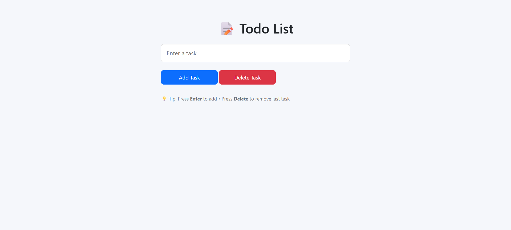

# 📝 Todo List App — Vanilla JavaScript

- A clean and lightweight Todo List application built using HTML, CSS, bootstrap and Vanilla JavaScript.
- The app allows users to manage daily tasks efficiently with persistent storage using LocalStorage.

---

## 🌍 Preview

---

## 🔗 Live Demo
![View Live] (https://mahir9104.github.io/todo-list-app/)

---

## ✨ Features

- ➕ Add new tasks.

- 🗑️ Delete the last task.

- 💾 Persistent storage using LocalStorage.

- 🔄 Tasks remain after page refresh.

- ⌨️ Keyboard shortcuts support.

- 📱 Responsive & mobile-friendly UI.

- ⚡ Fast and lightweight (no frameworks).

---

## ⌨️ Keyboard Shortcuts

# Action	                Shortcut
- Add task	                 Enter
- Delete last task	         Delete

---

## 🧠 How It Works

- Tasks are stored in a JavaScript array.
- Data is saved in the browser using localStorage.
- On page load, saved tasks are restored automatically.
- UI updates dynamically without reloading the page.

---

## 🛠️ Built With

- HTML5
- CSS3
- Bootstrap
- JavaScript (ES6)
- Browser LocalStorage

---

## 📂 Project Structure
todo-list/
│
├── index.html
├── style.css
├── script.js
└── READme.md

---

## 👨‍💻 Author

# Mahir Panchal 
- Learning **Full-Stack** Web Development.
- Focused on JavaScript & real-world projects.

⭐ If you find this project helpful, consider giving it a star!

---
